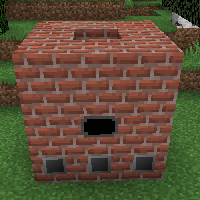

---
navigation:
  title: "Кокс"
  icon: "modern_industrialization:coke_oven"
  position: 9
  parent: modern_industrialization:steam_age.md
item_ids:
  - modern_industrialization:coke_oven
  - modern_industrialization:bronze_item_input_hatch
  - modern_industrialization:bronze_item_output_hatch
  - modern_industrialization:bronze_fluid_input_hatch
  - modern_industrialization:bronze_fluid_output_hatch
---

# Кокс

<GameScene zoom="3" interactive={true} fullWidth={true}>
    <MultiblockShape controller="coke_oven" />
</GameScene>

Після того, як вам достатньо бронзових машин, ви можете почати працювати над виготовленням сталі. Кінцева мета — побудувати кар’єр, багатоблок, який буде копати руду для вас!

Перший крок — створити кокс шляхом нагрівання вугілля без кисню. Для цього вам потрібно буде побудувати багатоблок коксової печі.

Для цього першого багатоблока вам, звісно, знадобиться сама коксова піч, 21 цегла та 3 *шлюзи*: вхідний предметний, вихід предметний та вхід рідинний.

За бажанням додайте вихідний рідинний шлюз, для креозоту.

<Recipe id="modern_industrialization:steam_age/fireclay/coke_oven" />

<Recipe id="modern_industrialization:hatches/bronze/item_input_hatch" />

<Recipe id="modern_industrialization:hatches/bronze/item_output_hatch" />

<Recipe id="modern_industrialization:hatches/bronze/fluid_input_hatch" />

<Recipe id="modern_industrialization:hatches/bronze/fluid_output_hatch" />

Блок коксової печі тут виконує роль *контролера*. Кожен багатоблок керується контролером, але зазвичай ви не можете взаємодіяти з контролером безпосередньо: усі вхідні та вихідні дані проходять через шлюзи. Нам потрібен вхід рідини, оскільки коксова піч живиться парою, вам потрібен вхід предмета для вугілля та вихід для коксу.

Ви можете за бажанням додати вихідний шлюз для рідини для креозоту. Це випадковий вихід і тому буде анульовано, якщо для нього немає місця.

Якщо ви забудете один із шлюзів, коксова піч не зможе запуститися!

**Тримайте гайковий ключ, щоб побачити відсутні блоки та помилки!** Ви також можете тримати шлюз, щоб знати, де це може поставити.

Вам потрібна 21 цегла для цього багатоблока! Перевірте REI, там зазначено, що всього 24, але у нас є 3 шлюзи, тому вам потрібні лише 21 цегла, що залишився!

## КОКС!

Є багато способів розміщення шлюзів, ось один з них!

Коли у меню коксової печі *недійсна форма*, наповніть вхідний рідинний шлюз парою, помістіть вугілля у вхідний предметний шлюз, і все готово!

Кокс буде дуже корисним для сталі, але це також потужне паливо. Воно триває в 4 рази довше, ніж вугілля!

